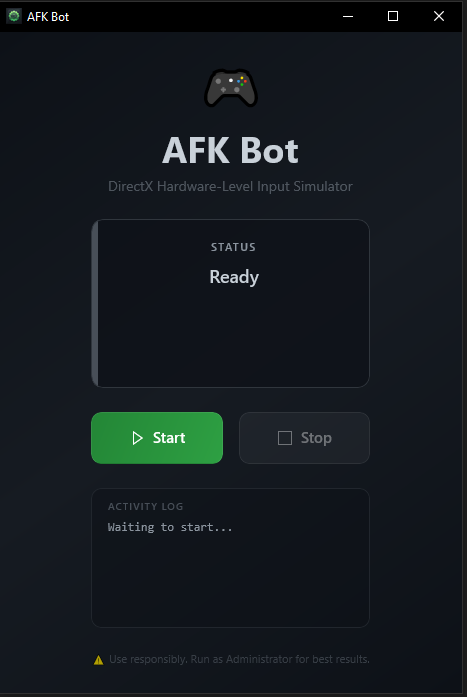
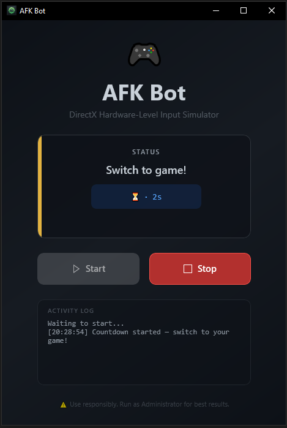

# AFK Util

A Windows desktop app that simulates WASD keyboard inputs to keep your system awake and prevent idle timeouts. Uses the Win32 `SendInput` API with hardware scan codes so it works even in DirectX games.

Built with **WinUI 3** and **.NET 8**.

## Screenshots

<p align="center">
  
  &nbsp;&nbsp;
  
</p>

## Features

- Hardware scan-code input via `SendInput` — DirectX/DirectInput compatible
- Random keys, hold times (1–3s), and wait intervals (10–15s)
- 5-second countdown before starting
- Async input loop, doesn't freeze the UI
- Matches system light/dark theme

## Requirements

- Windows 10 1809+ / Windows 11
- .NET 8.0 SDK
- Windows App SDK Runtime

## Build

```
dotnet build AfkBot.csproj -c Release -r win-x64
```
